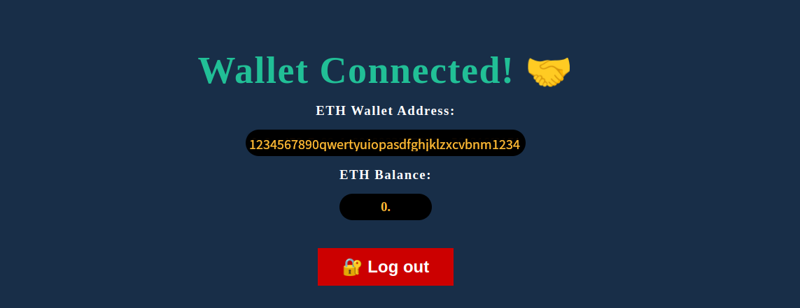

# Web3.js Blockchain Login

Following along a tutorial by [Ayodele Samuel Adebayo](https://hashnode.com/@unclebigbay).


[Web3.js](https://web3js.org/) is a collection of libraries that allow you to interact with a local or remote Ethereum node using HTTP, IPC, or WebSocket. Web3.js can be used in the frontend or backend of an application to read data from the blockchain.


__Blockchain__ authentication can be used to protect application with public data. It helps identify who is accessing the website and what data should be accessible for the logged-in user. This is the evolution coming from a __Basic Authentication__ system with a username and password in `web1` to __OAuth__ system allowing users to use their social media logins to login to another system with `web2` and on to `web3` - a decentralized system that does not involve a third-party that holds your data for you. Every user has complete control over their personal data using a __Decentralised Identity__.


## Proof-of-work Application

* Needs a login section where the user can connect to their wallet.
* Needs a dashboard section to display the logged-in user's wallet address and their Ethereum account balance.





```js
// Global wallet address variable
window.userWalletAddress = null
  
// Show wallet address from stored variable
const showUserWalletAddress = () => {
    const walletAddressEl = document.querySelector(".wallet-address")
    walletAddressEl.innerHTML = window.userWalletAddress
}

// Get wallet balance
const getWalletBalance = async () => {
    if (!window.userWalletAddress) {
      return false
    }
    const balance = await window.web3.eth.getBalance(window.userWalletAddress)
    // Convert the balance to ether
    document.querySelector(".wallet-balance").innerHTML = web3.utils.fromWei(
      balance,
      "ether"
    )
}

// Check if metamask is available and if user is logged in already
window.onload = async (event) => {

  // Check if ethereum extension is installed
  if (window.ethereum) {
    // Create instance
    window.web3 = new Web3(window.ethereum)
  } else {
    // Prompt to install
    alert("Please install MetaMask or any Ethereum Extension Wallet")
  }
  // Check if already logged in and update the global userWalletAddress variable
  window.userWalletAddress = window.localStorage.getItem("userWalletAddress")
  // Show dashboard
  showUserDashboard()
}
 
// Web3 login function
const loginWithEth = async () => {
    // Check if there is global instance
    if (window.web3) {
      try {
        // Get the user's account
        const selectedAccount = await window.ethereum
          .request({
            // Prompt metamask to login
            method: "eth_requestAccounts",
          })
          .then((accounts) => accounts[0])
          .catch(() => {
            // Catch cancelled login
            throw Error("Please select an account")
          })
  
        // Set global wallet address variable
        window.userWalletAddress = selectedAccount
  
        // Store in local storage => can be moved to db later
        window.localStorage.setItem("userWalletAddress", selectedAccount)
  
        // Show dashboard
        showUserDashboard()
  
      } catch (error) {
        alert(error)
      }
    } else {
      alert("Wallet not found")
    }
  }
  
// Bind function to login button
document.querySelector(".login-btn").addEventListener("click", loginWithEth)
  

// Show the user dashboard
const showUserDashboard = async () => {

    // If not logged in
    if (!window.userWalletAddress) {
  
      // Change the page title
      document.title = "Web3 Login"
  
      // Show the login
      document.querySelector(".login-section").style.display = "flex"
  
      // Hide dashboard
      document.querySelector(".dashboard-section").style.display = "none"
      return false;
    }
  
    // change the page title
    document.title = "Metamask Dashboard"
  
    // Hide the login
    document.querySelector(".login-section").style.display = "none"
  
    // Show dashboard
    document.querySelector(".dashboard-section").style.display = "flex"
  
    // Show wallet address from stored variable
    showUserWalletAddress()
    // Get wallet balance
    getWalletBalance();
};


// Web3 logout
const logout = () => {
    // Set the global userWalletAddress to null
    window.userWalletAddress = null
  
    // Remove wallet address from local storage
    window.localStorage.removeItem("userWalletAddress")
  
    // Show the user dashboard
    showUserDashboard()
  }
  
  // Bind function to logout button
  document.querySelector(".logout-btn").addEventListener("click", logout)
```